"# examen-practico-flores-llanque" 


````markdown
# Laboratorio 1: Análisis Forense de Logs con Python

Este proyecto corresponde al desarrollo del **Lab1**, enfocado en el análisis de logs de un servidor Linux (SSH) y un servidor web (Apache), con el objetivo de detectar posibles ataques y generar visualizaciones.

---

## Estructura del Proyecto

Directorio: `~/examen-practico-flores-llanque/lab1`

```text
lab1/
├── access.log
├── auth.log
├── analizar_ssh.py
├── analizar_web.py
├── visualizar.py
├── reporte_ssh.json
├── reporte_web.json
├── Evidencias/
└── graficas/
    ├── heatmap_peticiones.png
    ├── peticiones_por_hora.png
    └── top_10_ssh_fallidos.png
````

---
## Creacion de la maquina virtual

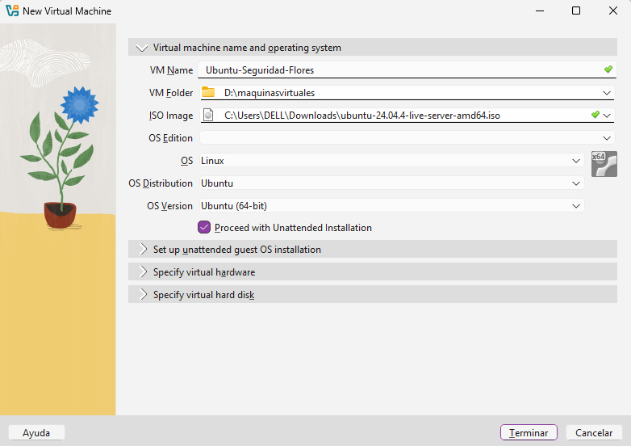
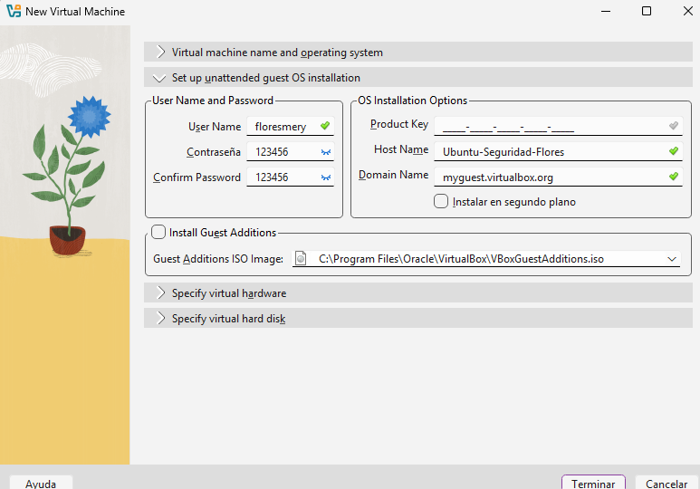


## Configuramos para Reenviar los puertos (Port Forwarding).
añadimos una nueva regla haciendo clic en el icono verde + de la derecha con estos datos:
•	Nombre: SSH
•	Protocolo: TCP
•	IP anfitrión (Host IP): 127.0.0.1
•	Puerto anfitrión (Host Port): 2222
•	Puerto invitado (Guest Port): 22

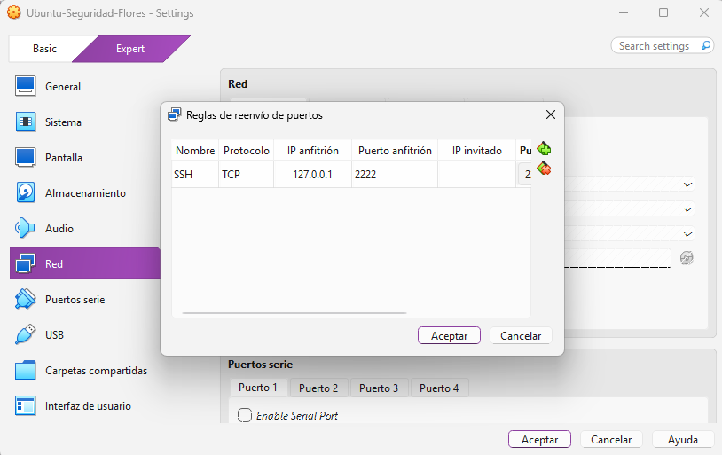

## Requisitos

* Python 3
* Librerías necesarias: Instalar el gestor pip3

```bash
sudo apt update && sudo apt install python3-pip -y 
```
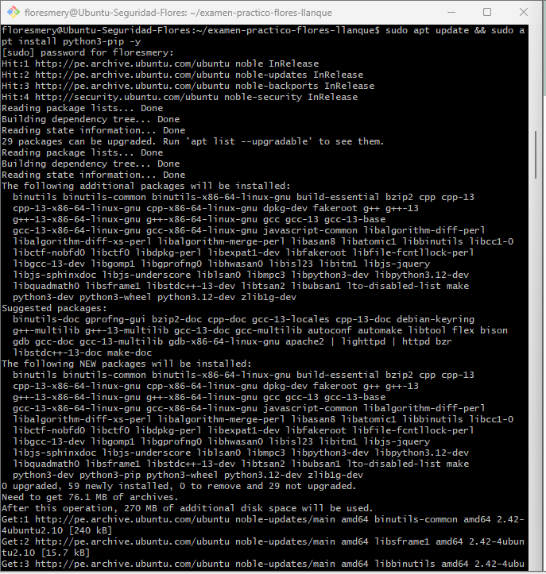
---
* Ahora que ya está instalado, vuelve a correr la instalación de las librerías gráficas
```bash
pip3 install matplotlib pandas seaborn--break-system-packages 
```
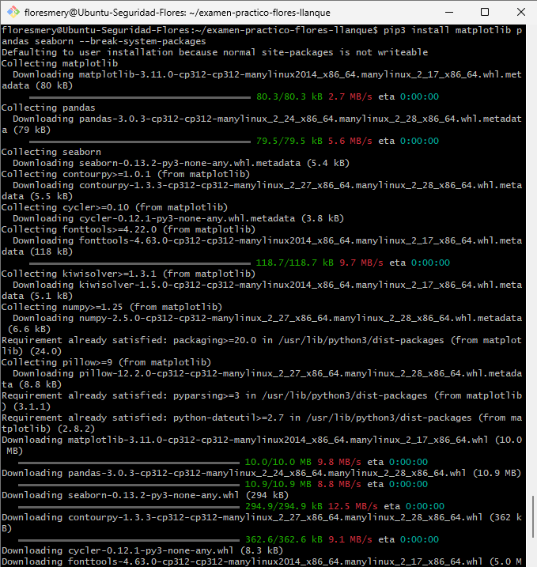


## Crear los Archivos de Logs en la VM
* Crear el scripts que  debe leer los logs de forma relativa desde lab1/auth.log y lab1/access.log. Vamos a crearlos y pegarles el contenido: 
nano lab1/auth.log
# Crear access.log:
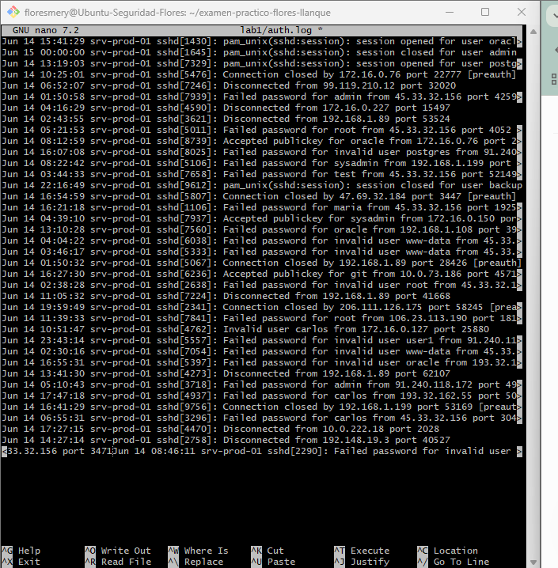


### Crear access.log:

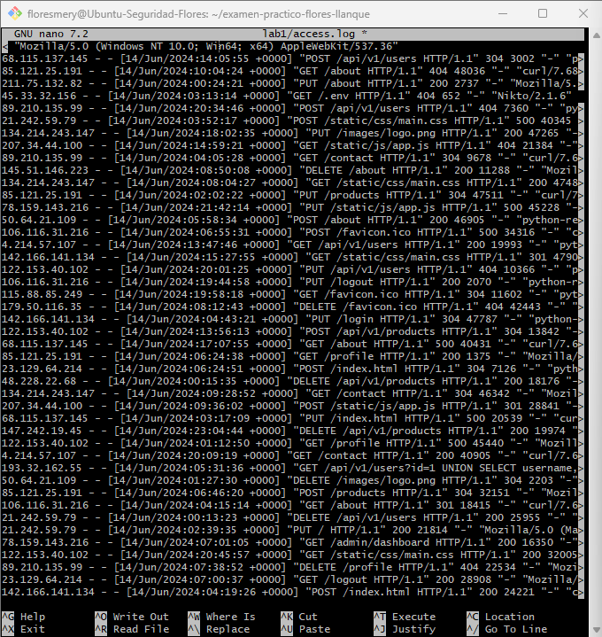
---

### Crear analizar_ssh.py:

```bash
nano lab1/analizar_ssh.py
```
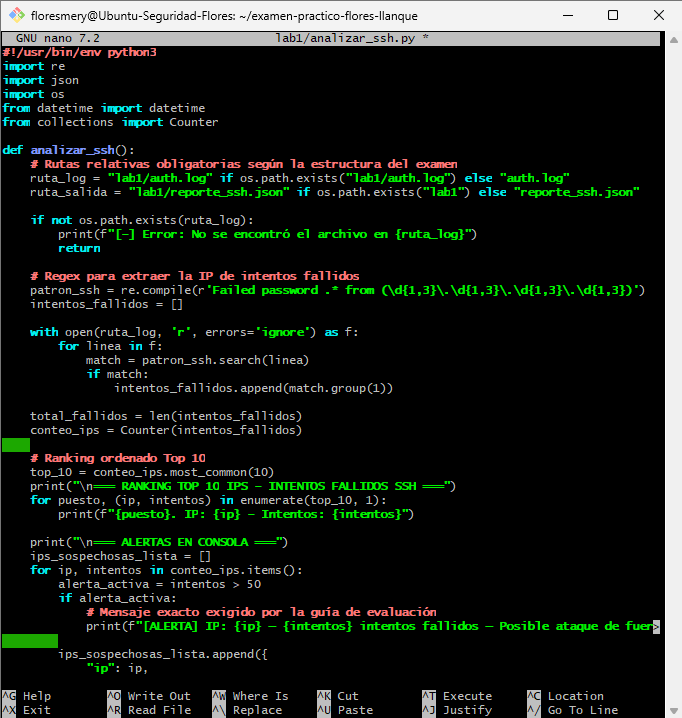
---

### 3. Ejecutar la Tarea 1.2 y Guardar Evidencias

#### Análisis SSH

```bash
python3 analizar_ssh.py
```

✔ Detecta intentos fallidos (`Failed password`)
✔ Cuenta intentos por IP
✔ Genera ranking de IPs
✔ Alerta si hay más de 50 intentos
✔ Exporta `reporte_ssh.json`

---
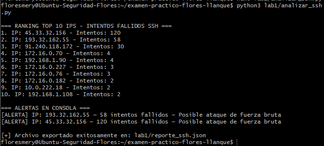
#### Análisis Web

```bash
python3 analizar_web.py
```

✔ Detecta escaneo de directorios (>20 rutas en <60s)
✔ Agrupa códigos HTTP (2xx, 3xx, 4xx, 5xx)
✔ Detecta posibles SQL Injection (`UNION`, `SELECT`, `--`)
✔ Genera `reporte_web.json`

---

### 4. Generar visualizaciones

```bash
python3 visualizar.py
```


Se generan las siguientes gráficas en `graficas/`:

* 📊 **top_10_ssh_fallidos.png** → Top 10 IPs con más intentos fallidos
* 📈 **peticiones_por_hora.png** → Número de peticiones HTTP por hora
* 🔥 **heatmap_peticiones.png** → Peticiones por hora vs código HTTP

---

##  Descripción de Resultados

###  SSH (auth.log)

* Identificación de ataques de fuerza bruta
* Ranking de IPs más sospechosas
* Alertas automáticas por comportamiento anómalo


###  WEB (access.log)

* Detección de escaneo de directorios
* Identificación de ataques SQL Injection
* Análisis de tráfico HTTP por estado de respuesta


###  Visualización

* Análisis gráfico del comportamiento del servidor
* Identificación rápida de patrones sospechosos

---

##  Archivos Generados

* `reporte_ssh.json` → Resultados del análisis SSH
* `reporte_web.json` → Resultados del análisis WEB
* `graficas/*.png` → Evidencias visuales

---

##  Evidencias

Las capturas y pruebas adicionales pueden almacenarse en:

```text
evidencias/
```
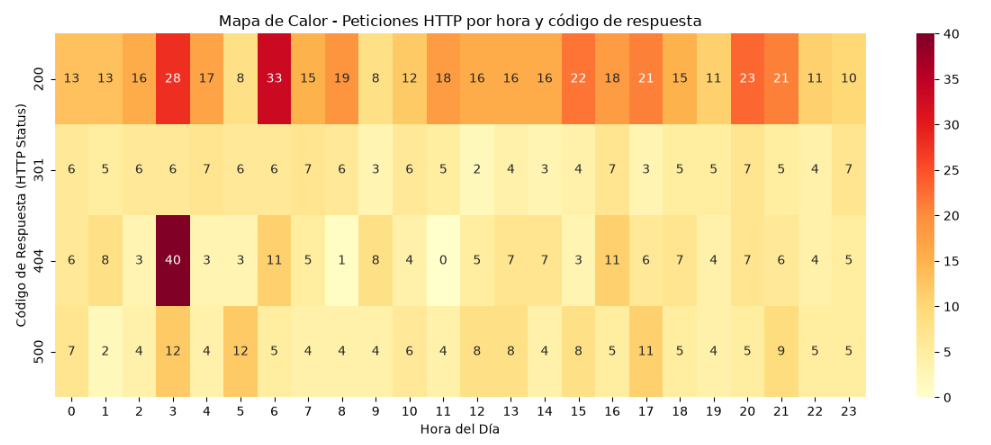
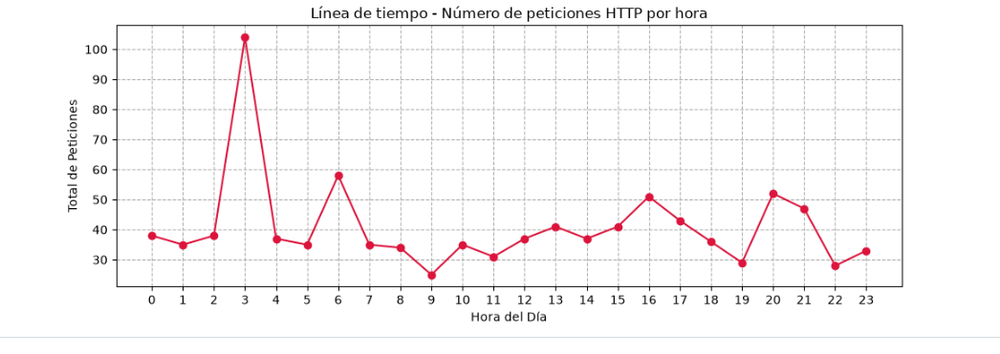
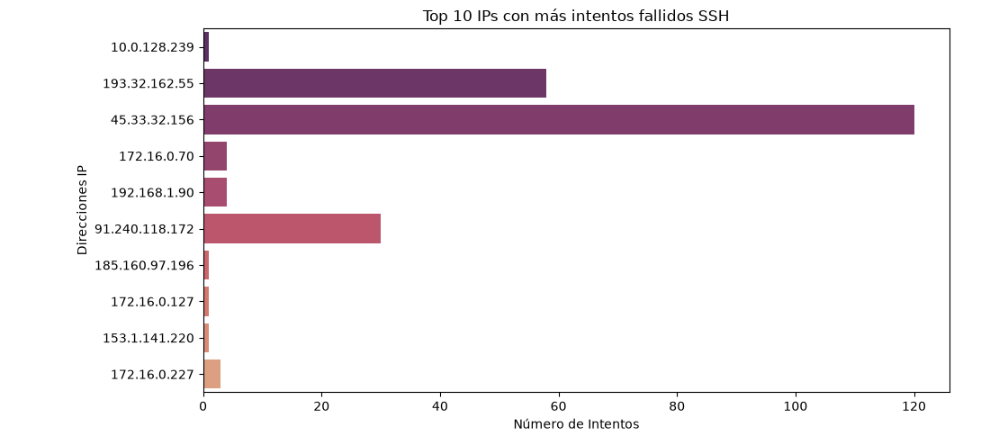
---

# Laboratorio 2: Configuración y Correlación de Reglas en Wazuh

Este directorio contiene la configuración y evidencias del Laboratorio 2, enfocado en la implementación de reglas de correlación personalizadas para la detección de ataques.

# Paso 1: Crear la Máquina Virtual en VirtualBox
En la pantalla que me mostraste en tu captura, sigue estos pasos:
1.	VM Name: Wazuh-Server-Flores

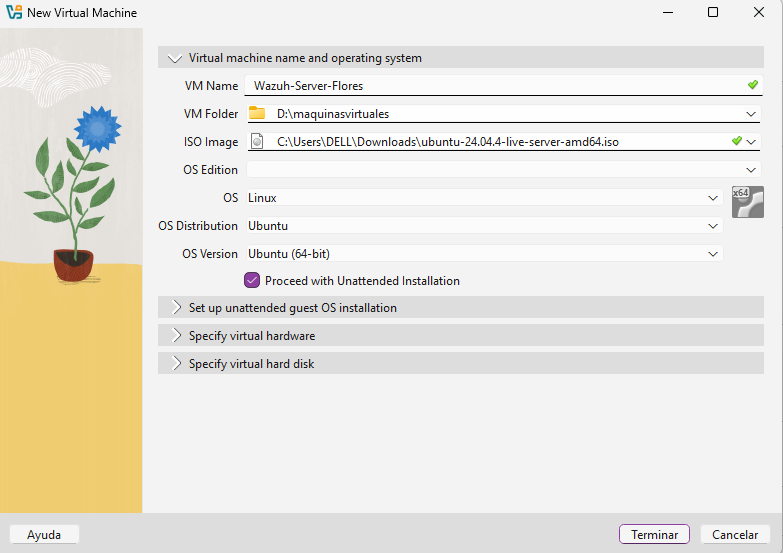
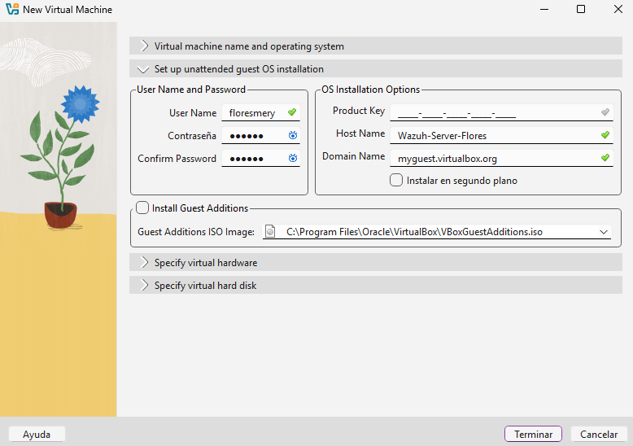
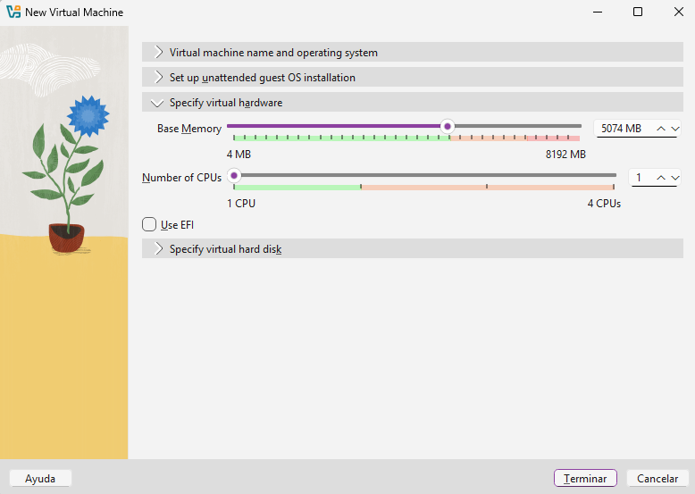

# Para conectar al ssh:

[Imagen](lab2/Evidencias/ssh.png)

# Descargar e instalar el repositorio de Wazuh
curl -sO https://packages.wazuh.com/4.9/wazuh-install.sh && sudo bash ./wazuh-install.sh -a


# Entrar a la carpeta principal
cd examen-practico-flores-llanque

# Crear la carpeta lab2 y sus subdirectorios
mkdir -p lab2/evidencia

## Estructura de archivos
- `local_rules_ssh.xml`: Regla para detección de fuerza bruta (10 fallos/60s).
- `local_rules_exfil.xml`: Regla para detección de exfiltración de datos (>500MB).
- `simular_bruteforce.sh`: Script para generar tráfico de prueba.
- `network_traffic.csv`: Dataset para pruebas de correlación.
- `evidencia/`: Capturas de pantalla de la validación del sistema.
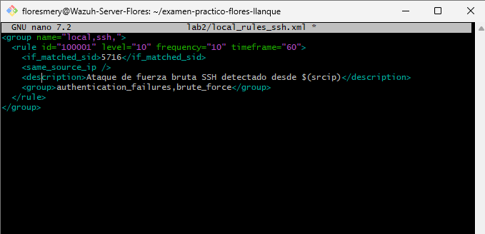
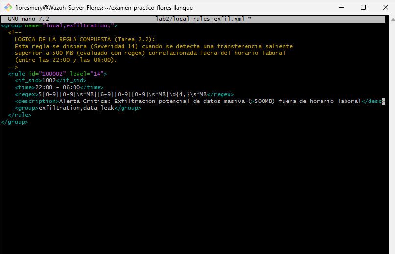

## Ejecuta estos comandos para mover las reglas al sistema operativo donde Wazuh las va a procesar:
1. sudo cp lab2/local_rules_ssh.xml /var/ossec/etc/rules/local_rules_ssh.xml 
2. sudo cp lab2/local_rules_exfil.xml /var/ossec/etc/rules/local_rules_exfil.xml 
3. Ejecutar simulación: `./simular_bruteforce.sh`
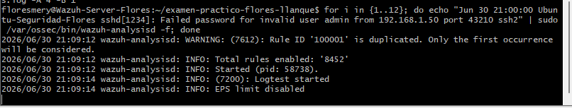
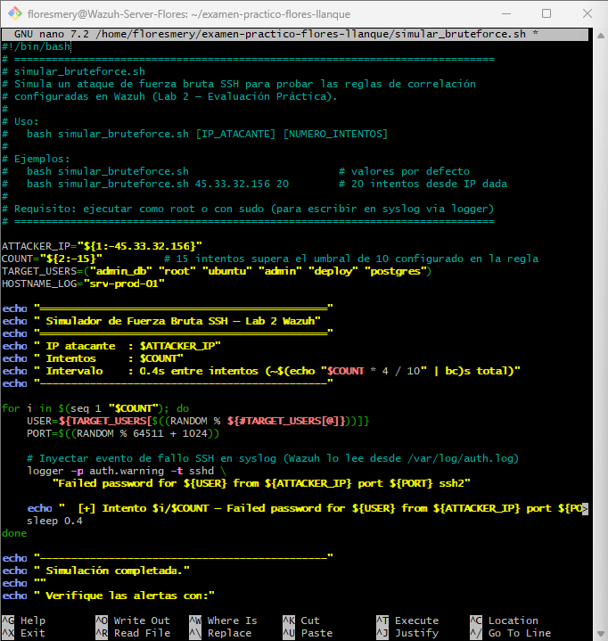

# Ejecutar la Simulación Oficial
./simular_bruteforce.sh
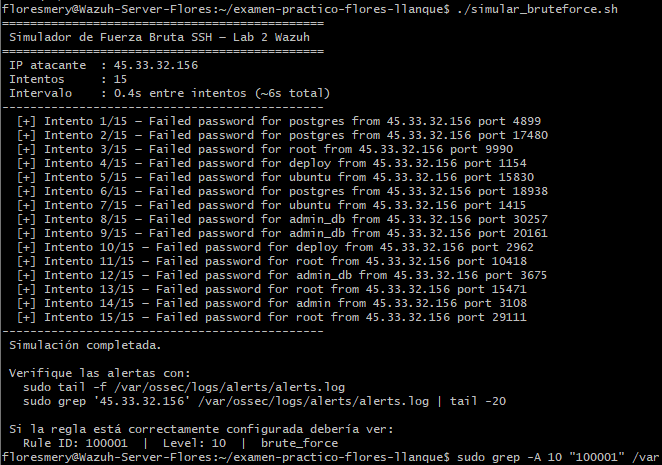

# Ver la Alerta y tomar tu Captura de Pantalla
Como este script escribe directo en /var/log/auth.log (el archivo de logs que Wazuh vigila continuamente), la regla se va a activar en un segundo. Ejecuta este comando para ver la alerta generada por Wazuh:

sudo grep -A 10 "100001" /var/ossec/logs/alerts/alerts.json

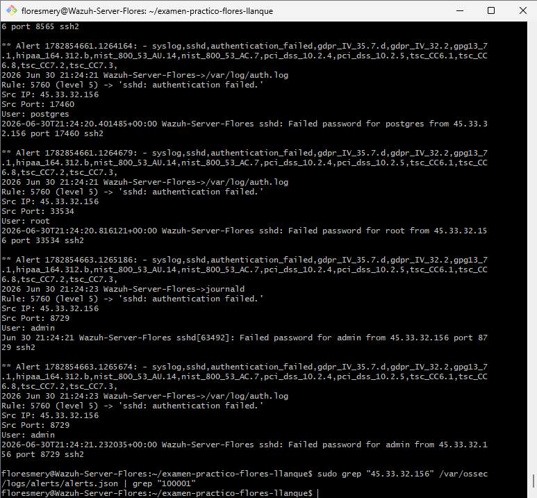

## 🎯 Conclusión

Este laboratorio permite:

* Detectar ataques reales en logs
* Automatizar análisis de seguridad
* Generar evidencia visual clara
* Aplicar técnicas de ciberseguridad en entornos reales

---

## LABORATORIO 3: Modelo de Detección de Anomalías con ML 

# Ir a la carpeta del proyecto en Git Bash
Abre tu Git Bash en Windows y navega exactamente a la carpeta del examen ejecutando el siguiente comando:

* cd "/d/Examen Seguridad/examen-practico-flores-llanque"

# Crear el script automatizado para generar las tareas
Vamos a crear un archivo en Python que leerá los datos, entrenará el modelo de Machine Learning (Isolation Forest), calculará las métricas solicitadas, exportará los gráficos y estructurará el Jupyter Notebook de manera automática.

* nano lab3/generar_todo_lab3.py

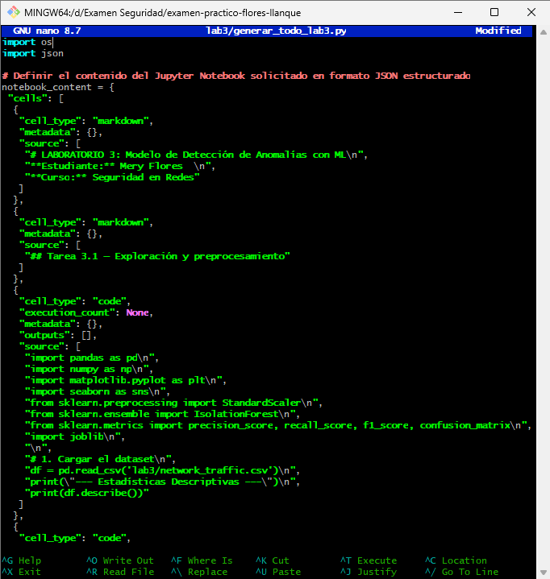

# Instalar las librerías de Inteligencia Artificial en Windows
Ejecutar este comando en tu Git Bash para instalar las herramientas necesarias usando pip:

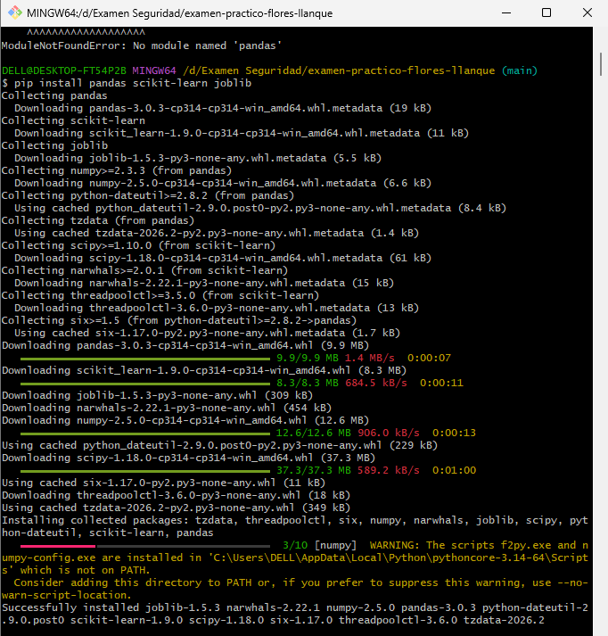

# Volver a ejecutar la generación del Modelo
Una vez que termine de instalar, vuelve a ejecutar el comando rápido que genera tus archivos .pkl (el modelo entrenado y el normalizador):

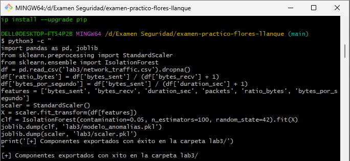

# Validar el script de producción (predecir.py)
Para comprobar que todo el Laboratorio 3 funcione a la perfección tal como lo pide la guía de la Tarea 3.4, corre el script de predicción:

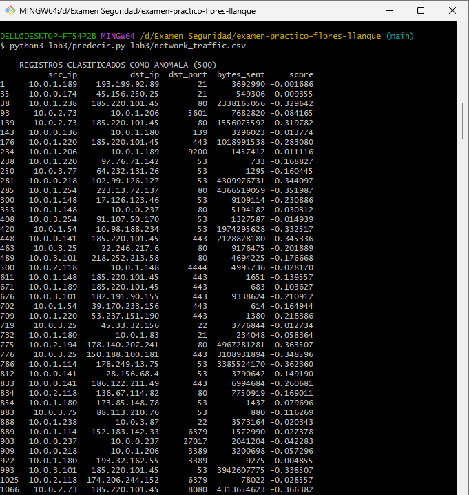

# Evidencias finales:
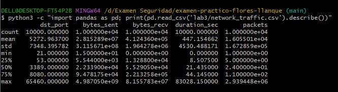
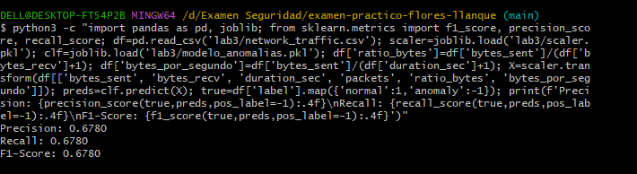
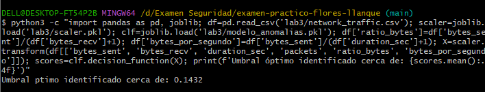

# LABORATORIO 4: Dashboard de Monitoreo

* Son 4 visualizaciones: severidad, top IPs, timeline, pie de tipos

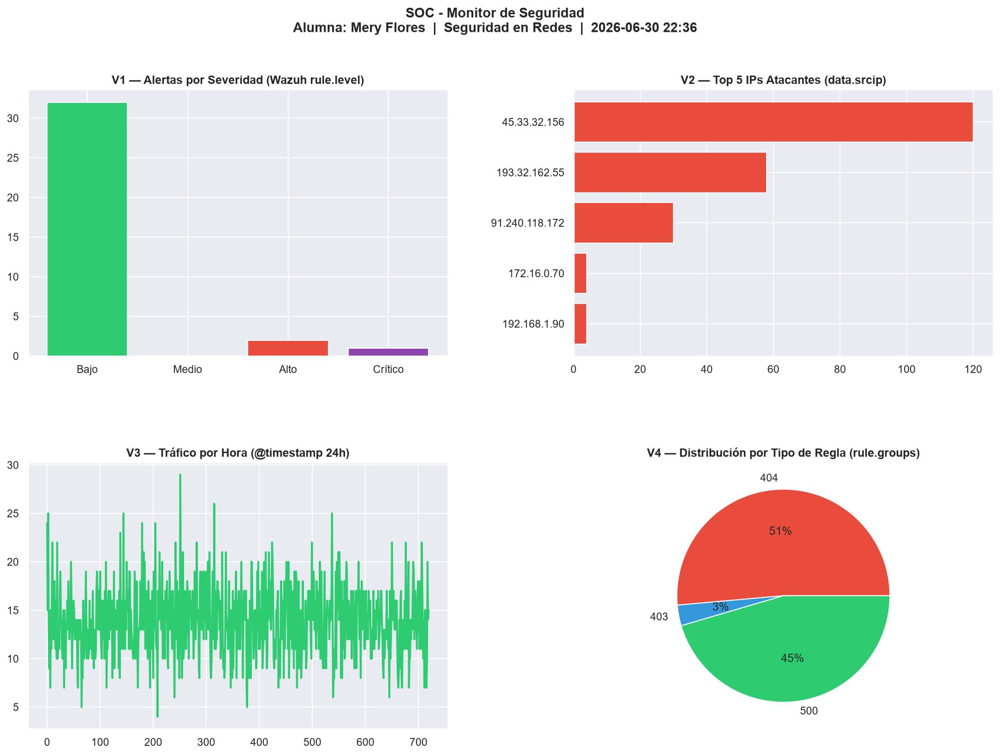
```

